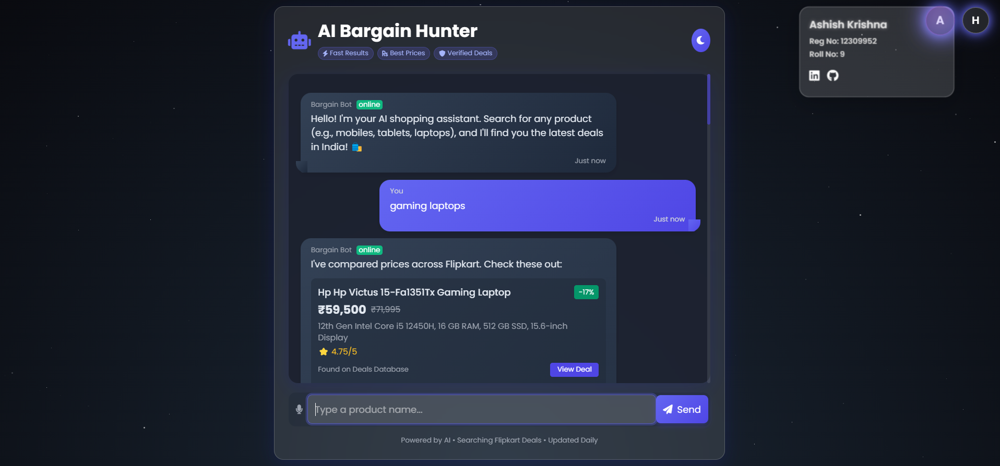

# AI Bargain Hunter 🛍️

An AI-powered shopping assistant that helps users find the best deals on electronics (mobiles, laptops, earphones, and more) in India. Built as a school project with a stunning glassmorphism UI, real-time deal fetching, and a dynamic chat interface.

## ✨ Features
- **Smart Search**: Search for products with price filters (e.g., "laptops under 50000").
- **Glassmorphism UI**: Beautiful design with day/night themes and animated background.
- **Developer Section**: Hover over the top-right ellipses to see developer details with a futuristic animation.
- **Real-Time Deals**: Fetches deals dynamically using PHP and Python.
- **Responsive Design**: Works seamlessly on desktop and mobile.

## 📸 Screenshots
| Chat Interface | Developer Section |
|----------------|-------------------|
|  |  |

## 🎥 Demo
Watch a quick demo of the app in action:  
[Demo Video](assets/demo.mp4)

## 🛠️ Tech Stack
- **Frontend**: HTML, Tailwind CSS, JavaScript
- **Backend**: PHP (for API), Python (for data preprocessing)
- **Data**: CSV files processed into JSON
- **Styling**: Glassmorphism with day/night themes
- **Dependencies**: FontAwesome, Google Fonts (Poppins)

## 🚀 How to Run
1. **Prerequisites**:
   - Install [XAMPP](https://www.apachefriends.org/index.html) to run the PHP server.
   - Install Python 3.x for data preprocessing.
2. **Setup**:
   - Clone this repository:
